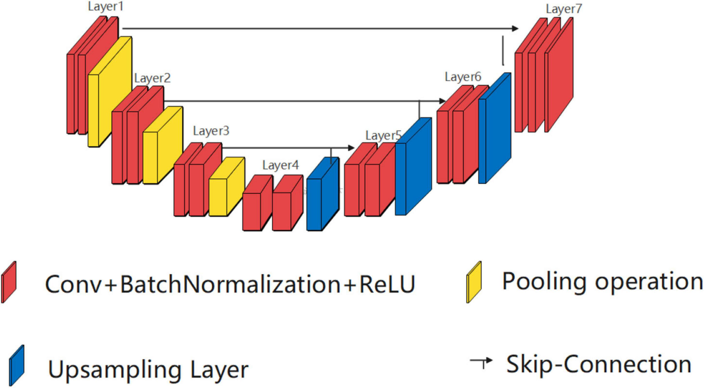
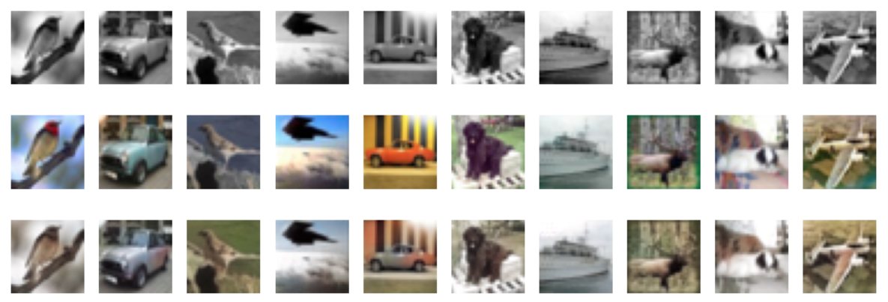

# Implement UNet from scratch with Keras and train on CIFAR10

## Prerequisites
- Python 3.6+
- Keras
- PyTorch
- Scikit-learn

## Architecture
<h3 align="center">
  
</h3>

## Evaluation
- **first row**: gray images
- **second row**: ground truth
- **third row**: colorized gray images with the model
<h3 align="center">
  
</h3>
